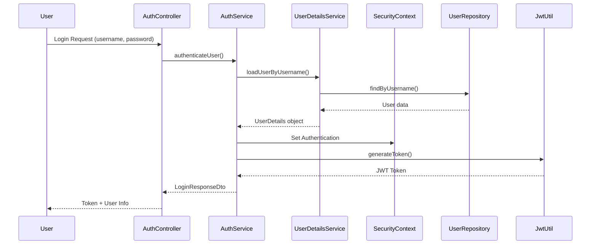
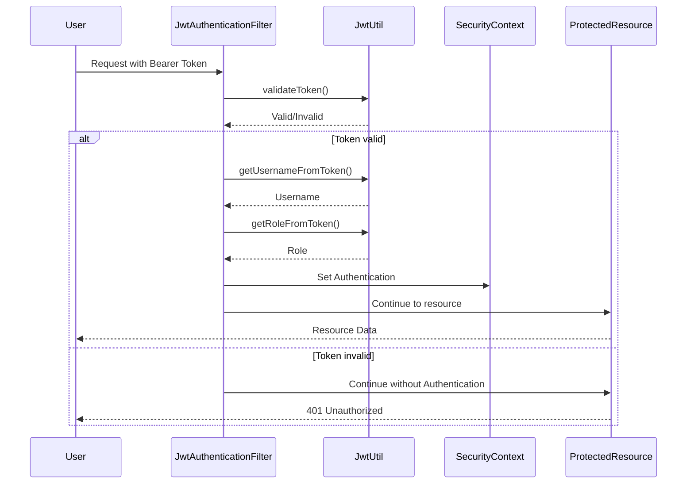
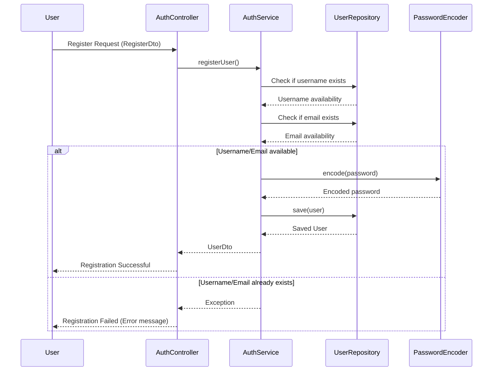
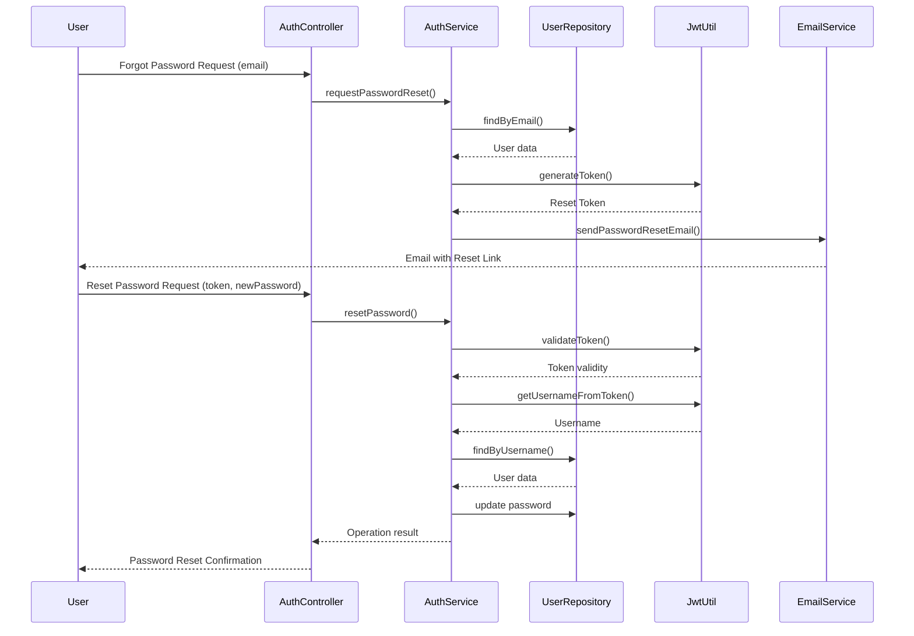
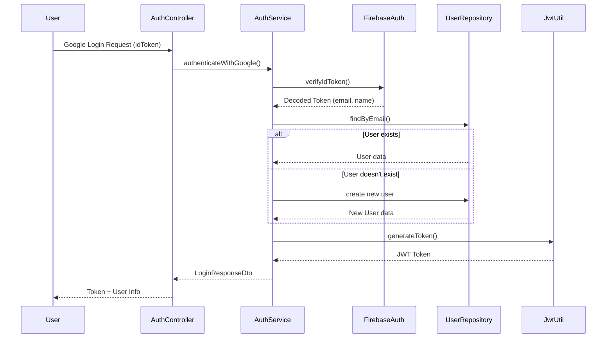

# Vietnamese Educational System - Login Flow Architecture

## Authentication Flow

## Token Validation Flow

## Registration Flow

## Password Reset Flow

## Google Authentication Flow

## Architecture Components

### Controllers
- **AuthController**: Handles authentication requests (login, registration, password reset)
- **UserController**: User management operations
- **AdminController**: Administrative functions

### Services
- **AuthService**: Authentication business logic
- **UserService**: User management business logic
- **EmailService**: Email sending functionality

### Security
- **JwtUtil**: JWT token generation, validation and manipulation
- **JwtAuthenticationFilter**: Filter for checking JWT tokens in requests
- **SecurityConfig**: Spring Security configuration
- **CustomUserDetailsService**: User details loading for Spring Security

### Data
- **User**: User entity
- **UserRepository**: Data access for users
- **UserDto**: User data transfer object
- **LoginRequestDto/LoginResponseDto**: Login data transfer objects

### Exceptions
- **GlobalExceptionHandler**: Centralizes exception handling
- **CustomExceptions**: Application-specific exceptions
